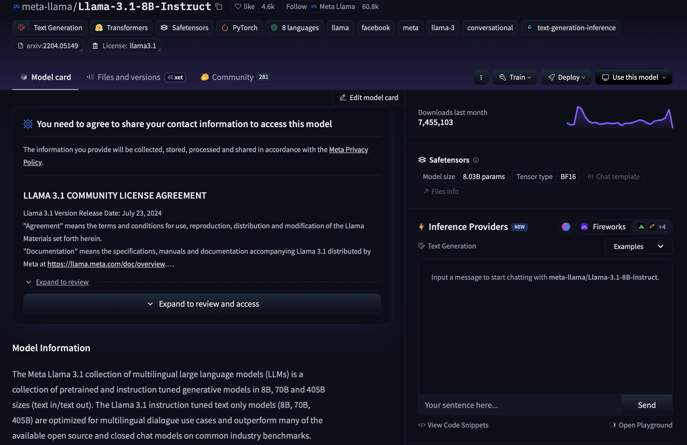
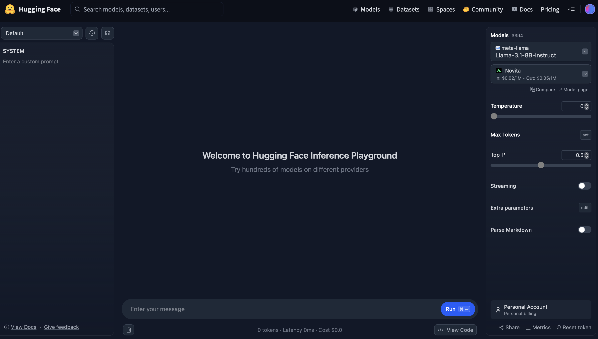
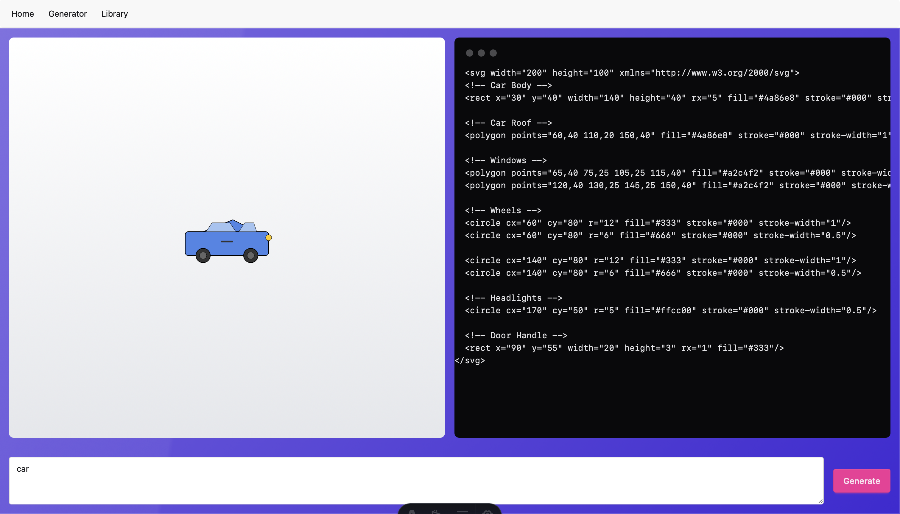
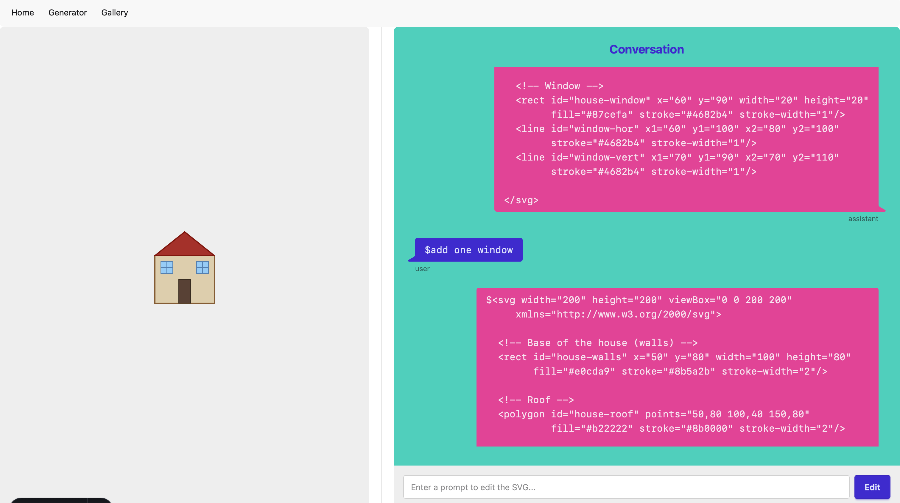

# TD et TP 3: Creation d'un site de generation de SVG
## Objectifs pédagogiques

L'objectif de cette semaine est de créer un site intégrant une IA générative pour la création de SVG. Nous utiliserons le fournisseur d'inférence HuggingFace pour accéder à des modèles LLM. Nous apprendrons également comment créer et effectuer des appels à des API côté serveur pour des raisons de sécurité.

## Utilisation de HuggingFace inference povider

[HuggingFace](https://huggingface.co/) est une plateforme collaborative dédiée à l'intelligence artificielle, spécialisée dans le partage de modèles de machine learning. Elle permet aux utilisateurs d'accéder facilement à des modèles pré-entraînés, de les tester, de les intégrer dans leurs applications et de contribuer à la communauté open source. Il est devenu une sorte de “GitHub de l’IA”.

**Étapes à suivre :**

1. Créez un compte personnel sur [HuggingFace](https://huggingface.co/).
2. Cliquez sur votre image de profil en haut à droite, puis sélectionnez `Access Tokens`.
3. Créez un nouveau `Access Token` en cochant la case `Make calls to Inference Providers`. Conservez ce token, il vous servira pour accéder aux modèles. Vous pouvez toujours créer un nouveau.
4. Vous disposez d’un crédit gratuit de 0,10 $ pour tester les modèles. Le coût dépend du modèle choisi et de la longueur du messages et de la réponse générée.

**Découverte des modèles :**

- Parcourez la liste des modèles pour choisir celui qui vous intéresse. Par exemple, sélectionnez `meta-llama/Llama-3.1-8B-Instruct` et cliquez sur `open playground`.


- Dans la section de gauche, ajoutez un messages système, par exemple :  
    `You are an SVG generation tool. Generate only the SVG code without any explanation.`
- Dans le champ du messages, demandez la génération d’un objet, par exemple :  
    `a red car`
- Copiez le résultat obtenu et affichez-le sur le site [SVGViewer](https://www.svgviewer.dev) pour visualiser le SVG.
- Essayez également un modèle plus puissant, comme `deepseek-ai/DeepSeek-V3.1`.
- Essayez 2 ou 3 autres modèles et noter celui avec le meilleur résultat pour l'utiliser après dans votre site.

> **Remarque :** La réponse générée peut être influencée par l’historique de la conversation. Pensez à l’effacer si vous changez de messages ou de modèle.


## Création du site
1. Créez un site avec deux pages :
    - `index.astro`: la page principale
    - `generator.astro`: la page de génération

2. Dans `generator.astro`, créez une interface qui contient trois `div` en utilisant Tailwind CSS et DaisyUI :
    - Une avec un `textarea` et un `button` pour entrer le messages de l'utilisateur
    - Une pour afficher le code généré
    - Une pour afficher le SVG

    Par exemple :
    

- Faites un commit puis un push

> **Important :** L’appel à l’API d’inférence de Hugging Face doit se faire côté serveur afin de ne pas exposer votre token d’accès. Pour cela, nous allons créer un `API endpoint` et l’appeler depuis le client avec la fonction `fetch`.

3. Pour commencer, créez un fichier nommé `.env` à la racine de votre projet. Ce fichier va contenir vos informations sensibles, comme vos clés d’API.
```
HF_TOKEN = "VOTRE_ACCESS_TOKEN"
HF_URL = https://router.huggingface.co/v1
```
Le fichier .env contient des informations sensibles (le access token), il ne doit jamais être partagé publiquement. Assurez-vous que .env est dans gitignore pour que Git ignorera ce fichier lors des commits et des pushes.

Dans la suite, nous allons créer un endpoint. Un endpoint est une route API qui permet au serveur, au lieu de retourner une page HTML, de renvoyer d’autres types de contenu, comme par exemple du JSON, du texte, des images, etc. 

1. Lisez la documentation sur les endpoints dans astro: [Astro endpoints](https://docs.astro.build/en/guides/endpoints/)

2. Créez le fichier `src/api/generateSVG.js` avec le contenu suivant:
```js
// src/pages/api/generate-svg.js
import { OpenAI } from 'openai';

// Récupération du token d'accès à partir des variables d'environnement
const HF_TOKEN = import.meta.env.HF_TOKEN;

// Fonction exportée pour gérer les requêtes POST
export const POST = async ({ request }) => {
    console.log(request); // Affiche la requête dans la console pour le débogage
    
    // Extraction du messages du corps de la requête
    const { messages } = await request.json();
    // Initialisation du client OpenAI avec l'URL de base et le token d'API
    const client = new OpenAI({
      baseURL: import.meta.env.HF_URL,
      apiKey: HF_TOKEN,
    });
    
    // ................
    const chatCompletion = await client.chat.completions.create({
    model: NOM_MODEL,
    messages: [
      {
          role: "system", 
          content: "You are an SVG code generator. Generate SVG code for the following messages." 
      },
        {
            role: "user",
            content: messages,    
        },
    ],
  });
    // ...............

    // Récupération du message généré par l'API
    const message = chatCompletion.choices[0].message.content || "";
    console.log('message', message); // Affiche le message généré dans la console pour le débogage
    
    // Recherche d'un élément SVG dans le message généré
    const svgMatch = message.match(/<svg[\s\S]*?<\/svg>/i);
    // Retourne une réponse JSON contenant le SVG ou une chaîne vide si aucun SVG n'est trouvé
    return new Response(JSON.stringify({ svg: svgMatch ? svgMatch[0] : "" }), {
      headers: { "Content-Type": "application/json" },
    });
};
```

Le code de ce fichier met en place un endpoint serveur pour générer du code SVG à partir d’un messages texte. Le messages est envoyé depuis le client via une requête POST en JSON en utilisant fetch. Il renvoie au client uniquement le code SVG généré, prêt à être affiché dans une page HTML.

7. Maintenant l'endpoint est prêt. Nous utiliserons la fonction `fetch` pour appeler cette endpoint en envoyant le messages de l'utilisateur. Pour faire, ajoutez le script suivant dans la page `generate.astro`:

```js
<script>
    //@ts-nocheck
	
	async function generateSVG(messages) {
		console.log('Generating SVG for messages:', messages);
		const res = await fetch('/api/generateSVG', {
			method: 'POST',
			headers: { 'Content-Type': 'application/json' },
			body: JSON.stringify({ messages }),
		});
		const data = await res.json();
		return data.svg;
	}

	async function handleSubmit() {
        let messages = "";
        let svgCode = "";
        const messagesElement = document.getElementById("user-messages");
        messages = messagesElement ? messagesElement.value : "";
        console.log('submitted: ', messages); // message affiché sur votre console d'inspecteur dans le navigateur
        const svgContainer = document.getElementById("svg-container");
        let svgOutput = document.getElementById("svg-output");
        svgCode = await generateSVG(messages);
        console.log('svgCode: ', svgCode);
        svgOutput.textContent = svgCode;
        svgContainer.innerHTML = svgCode;
        generateButton.disabled = false;

	}
    const generateButton = document.getElementById("generate-button");
	if (generateButton) {
		generateButton.addEventListener("click", handleSubmit);
	}
</script>
```

Assurez-vous que les IDs correspondent à ceux présents dans votre HTML.

8. 	Ajoutez un loading spinner et désactivez le bouton pendant que vous attendez la réponse du serveur, au bon endroit dans la fonction `handleSubmit()` :
```js
svgContainer.innerHTML = `<span class="loading loading-ring loading-xl"></span>`;
generateButton.disabled = true;
```

- Faites un commit puis un push

Si vous avez du temps restant, ajoutez un bouton permettant d’enregistrer les codes SVG avec un nom choisi par l’utilisateur dans une collection PocketBase, puis affichez-les sur une troisième page.

---

# TD et TP 4:
__Objectif pédagogique__: Utiliser l'IA pour configurer les SVG générés.

## Utilisation de l'inference gratuit de OpenRouter.
- Créez un compte sur [OpenRouter](https://openrouter.ai/). OpenRouter fournit des modèles avec de l'inférence gratuite.
- Récupérez votre clé d'accès de la même manière que pour HuggingFace.
- Choisissez un modèle gratuit, par exemple : `openai/gpt-oss-20b:free`.
- Modifiez l'URL et la clé dans votre code pour utiliser l'inférence d'OpenRouter à la place de HuggingFace.

## Modification de l'endpoint generateSVG.js

Modifier l'endpoint `generateSVG.js` pour qu'il recoit l'historique de la conversation dans la `request`:

```js
export const POST = async ({ request }) => {
    // Affiche la requête dans la console pour le débogage
    console.log(request);

    // Extraction des message du corps de la requête
    const { messages } = await request.json();
    
    // Initialisation du client OpenAI avec l'URL de base et le token d'API
    const client = new OpenAI({
        baseURL: BASE_URL, // URL de l'API
        apiKey: ACCESS_TOKEN, // Token d'accès pour l'API
    });
    
    // Création du message système pour guider le modèle
    let SystemMessage = 
        {
            role: "system", // Rôle du message
            content: "You are an SVG code generator. Generate SVG code for the following messages. Make sure to include ids for each part of the generated SVG.", // Contenu du message
        };
    
    // Appel à l'API pour générer le code SVG en utilisant le modèle spécifié
    const chatCompletion = await client.chat.completions.create({
        model: "NOM_MODEL", // Nom du modèle à utiliser
        messages: [SystemMessage, ...messages] // Messages envoyés au modèle, incluant le message système et l'historique des messages
    });
    
    // Récupération du message généré par l'API
    const message = chatCompletion.choices[0].message || "";
    
    // Affiche le message généré dans la console pour le débogage
    console.log("Generated SVG:", message);
    
    // Recherche d'un élément SVG dans le message généré
    const svgMatch = message.content.match(/<svg[\s\S]*?<\/svg>/i);
    
    // Si un SVG est trouvé, le remplace dans le message, sinon laisse une chaîne vide
    message.content = svgMatch ? svgMatch[0] : "";
    
    // Retourne une réponse JSON contenant le SVG généré
    return new Response(JSON.stringify({ svg: message }), {
        headers: { "Content-Type": "application/json" }, // Définit le type de contenu de la réponse
    });
};
```

- Dans le script de `generator.astro`, ajoutez une liste qui contiendra l'historique des échanges :
```js
let promptList = [];
```

Cette liste doit contenir les prompts sous la forme suivante :

```js
[
    {
        role: 'user',
        content: PROMPT...
    },
    {
        role: 'assistant',
        content: REPONSE...
    }
]
```

- Mettez à jour la fonction `handleSubmit` pour qu'elle ajoute chaque prompt utilisateur à la liste avant de l'envoyer :
```js
async function handleSubmit() {
    let prompt = "";
    let aiResponse = "";
    const promptElement = document.getElementById("user-prompt");
    prompt = promptElement ? promptElement.value : "";
    console.log("submitted: ", prompt);
    // Réinitialiser la liste des prompts
    promptList.length = 0; 
    promptList.push({ role: "user", content: prompt });
    const svgContainer = document.getElementById("svg-container");
    // Afficher un spinner
    svgContainer.innerHTML = `<span class="loading loading-ring loading-xl"></span>`;
    generateButton.disabled = true;
    editButton.disabled = true;
    let svgOutput = document.getElementById("svg-output");
    // Appeler la fonction pour générer le SVG
    aiResponse = await generateSVG(promptList);
    // Extraire le SVG de la réponse
    const svgMatch = aiResponse.content.match(/<svg[\s\S]*?<\/svg>/i);
    aiResponse.content = svgMatch ? svgMatch[0] : "";
    console.log("svgCode: ", aiResponse.content);
    // Ajouter la réponse de l'IA à la liste des prompts
    promptList.push(aiResponse);
    // Afficher le SVG généré
    svgOutput.textContent = aiResponse.content;
    svgContainer.innerHTML = aiResponse.content;
    // Réactiver les boutons
    generateButton.disabled = false;
    editButton.disabled = false;
}
```

- Réessayez et effectuez un commit. Cela doit fonctionner comme auparavant.

Dans la suite nous allons ajouter une fonctionnalité qui permet d'éditer le svg générer en language naturel.

## Modification du SVG généré

- Ajouter un bouton `edit`.
```html
<button class="btn btn-secondary m-2" id="edit-button">Edit</button>
```

- Ajouter la fonction `handleEdit()`. Cette fonction doit ajouter la requête saisie à la liste `promptList`, envoyer une requête `POST` à l'endpoint `generateSVG` contenant `promptList`, ajouter la réponse dans `promptList`, puis mettre à jour le SVG affiché.

```js
const editButton = document.getElementById("edit-button");

async function handleEdit() {
    let prompt = "";
    let aiResponse = "";
    const promptElement = document.getElementById("user-prompt");
    prompt = promptElement ? promptElement.value : "";
    console.log("Prompt soumis : ", prompt);
    // Ajout du prompt de l'utilisateur à la liste
    promptList.push({ role: "user", content: prompt });
    const svgContainer = document.getElementById("svg-container");
    // Afficher un spinner de chargement
    svgContainer.innerHTML += `<span class="loading loading-ring loading-xl"></span>`;
    generateButton.disabled = true;
    editButton.disabled = true;
    let svgOutput = document.getElementById("svg-output");
    // Appeler la fonction pour générer le SVG
    aiResponse = await generateSVG(promptList);
    // Extraire le SVG de la réponse
    const svgMatch = aiResponse.content.match(/<svg[\s\S]*?<\/svg>/i);
    aiResponse.content = svgMatch ? svgMatch[0] : "";
    console.log("Code SVG généré : ", aiResponse.content);
    // Ajouter la réponse de l'IA à la liste des prompts
    promptList.push(aiResponse);
    // Afficher le SVG généré
    svgOutput.textContent = aiResponse.content;
    svgContainer.innerHTML = aiResponse.content;
    // Réactiver les boutons
    generateButton.disabled = false;
    editButton.disabled = false;
    console.log("Historique des prompts : ", promptList);
}

if (editButton) {
    editButton.addEventListener("click", handleEdit);
}
```

## Sauvgarde du SVG

-  Ajoutez un bouton `Sauvegarder` dans l'interface utilisateur pour permettre l'enregistrement des SVG générés.
- Créez une nouvelle collection dans PocketBase avec les champs suivants : `name`, `code_svg`, `chat_history`.

> ⚠️ N'oubliez pas d'utiliser pocketbase-typegen pour les types.


- Ajouter un endpoint `pages/api/saveSVG.js` qui permet de sauvegarder le SVG dans PocketBase :
```js
import pb from "../../utils/pb";
import { Collections } from "../../utils/pocketbase-types";

export async function POST({ request }) {
  const data = await request.json();
  console.log("Received data to save:", data);
  try {
    const record = await pb
      .collection(Collections.Svg)
      .create(data);
    console.log("SVG saved with ID:", record.id);

    return new Response(JSON.stringify({ success: true, id: record.id }), {
      headers: { "Content-Type": "application/json" },
    });
  } catch (error) {
    console.error("Error saving SVG:", error);
    return new Response(JSON.stringify({ success: false, error: error.message }), {
      headers: { "Content-Type": "application/json" },
      status: 500,
    });
  }
}
```

- Dans le fichier `generator.astro`, ajoutez le gestionnaire d'événements pour le bouton de sauvegarde :
- 
```js
const saveButton = document.getElementById("save-button");
    async function saveSVG(params) {
        const res = await fetch("/api/saveSVG", {
            method: "POST",
            headers: { "Content-Type": "application/json" },
            body: JSON.stringify(params),
        });
        const data = await res.json();
        return data;
    }
    if (saveButton) {
        saveButton.addEventListener("click", async () => {
            const name = prompt("Entrez un nom pour le SVG :");
            const svgOutput = document.getElementById("svg-output")?.textContent;
            console.log("Sauvegarde du SVG : ", JSON.stringify(svgOutput));
            
            const params = {
                nom: name,
                code_svg: svgOutput || "<svg></svg>",
                chat_history: JSON.stringify(promptList),
            };
            await saveSVG(params);
        });
    }
```

Dans le fichier generator.astro, ajoutez le gestionnaire d'événements pour le bouton de sauvegarde :
```js
// Fonction utilitaire pour sauvegarder le SVG
const saveButton = document.getElementById("save-button");

async function saveSVG(params) {
    // Envoi de la requête à notre endpoint
    const res = await fetch("/api/saveSVG", {
        method: "POST",
        headers: { "Content-Type": "application/json" },
        body: JSON.stringify(params),
    });
    return await res.json();
}

// Gestionnaire d'événements pour le bouton de sauvegarde
if (saveButton) {
    saveButton.addEventListener("click", async () => {
        // Demande du nom du SVG à l'utilisateur
        const name = prompt("Donnez un nom à votre création :");
        const svgOutput = document.getElementById("svg-output")?.textContent;
        console.log("Préparation de la sauvegarde :", JSON.stringify(svgOutput));
        
        // Préparation des données pour la sauvegarde
        const params = {
            nom: name,
            code_svg: svgOutput || "<svg></svg>", // SVG par défaut si vide
            chat_history: JSON.stringify(promptList), // Historique des échanges
        };
        
        // Sauvegarde et gestion de la réponse
        const result = await saveSVG(params);
        if (result.success) {
            alert("SVG sauvegardé avec succès !");
        } else {
            alert("Erreur lors de la sauvegarde : " + result.error);
        }
    });
}
```
Cette implémentation permet de :
1. Capturer le SVG généré
2. Demander un nom à l'utilisateur
3. Sauvegarder l'ensemble dans PocketBase
4. Informer l'utilisateur du résultat de l'opération

- Ajoutez une page `gallery\index.astro` pour afficher les SVG sauvegarder si ce n'est pas encore fait en TD 3.

## Modification des SVG sauvegardés

Dans cette partie, vous allez créer une interface de chat permettant de modifier un SVG déjà généré. L'objectif est de permettre à l'utilisateur de discuter avec l'IA pour affiner ou transformer le SVG, tout en visualisant l'historique des échanges.

### 1. Création d'une route dynamique

Créez une nouvelle page dynamique nommée `gallery/[id].astro`. Cette page affichera un SVG sauvegardé ainsi que l'historique des échanges associés à ce SVG.

### 2. Récupération du SVG et de l'historique

Dans le frontmatter de la page, récupérez le SVG et son historique depuis PocketBase à l'aide de l'identifiant passé dans l'URL :

```astro
---
import Layout from "../../layouts/Layout.astro";
import pb from "../../utils/pb";
import { Collections, type SvgRecord } from "../../utils/pocketbase-types";

const id = Astro.params.id;
const svg: SvgRecord = await pb.collection(Collections.Svg).getOne(id);
---
```

### 3. Construction de l'interface utilisateur


L'interface doit comporter deux parties principales :

- Une `div` pour afficher le SVG généré.
- Une zone de chat permettant d'afficher l'historique des échanges et d'envoyer de nouveaux prompts à l'IA.

Utilisez les composants `divider` et `chat bubble` de DaisyUI pour structurer l'interface.

#### Exemple de code HTML pour l'historique du chat

```html
<div id="chat-history" class="flex flex-col gap-4 w-full mb-20 overflow-y-auto flex-grow">
    {
        (Array.isArray(svg?.chat_history) && svg.chat_history.length > 0) ? (
            svg.chat_history.map((msg: { role: string; content: string; }) => (
                <div class={`chat ${msg.role === 'user' ? 'chat-start' : 'chat-end'}`}>
                    <div class={`chat-bubble ${msg.role === 'user' ? 'bg-primary text-primary-content' : 'bg-secondary text-secondary-content'}`}>
                        <pre>{msg.content}</pre>
                    </div>
                    <div class="chat-footer opacity-60 text-xs mt-1">{msg.role}</div>
                </div>
            ))
        ) : (
            <span class="text-error">Aucun historique de chat.</span>
        )
    }
</div>
```

### 4. Ajout du formulaire de chat

Sous la conversation, ajoutez un formulaire avec un champ de saisie pour permettre à l'utilisateur d'envoyer de nouveaux prompts à l'IA. À chaque envoi, le prompt et la réponse de l'IA doivent être ajoutés à l'historique et le SVG mis à jour en conséquence.

```html
<form id="input-prompt-form" class="flex flex-col gap-2 w-full absolute bottom-0 left-0 right-0 bg-base-300 p-4" method="POST" autocomplete="off" >
    <input type="hidden" name="history" value={JSON.stringify(svg?.chat_history)} />
    <input type="hidden" name="id" value={svg?.id} />
    <div class="flex items-center gap-2">
        <input id="prompt-input" name="editPrompt" type="text" class="input flex-grow" placeholder="Enter a prompt to edit the SVG..." />
        <button class="btn btn-primary" type="submit">Edit</button>
    </div>
</form>
```

> Les champs de type `hidden` dans un formulaire permettent d'envoyer des informations sans les afficher à l'utilisateur. Cela peut être utile pour transmettre des données supplémentaires, comme des identifiants  tout en gardant l'interface utilisateur propre et simple.


### 5. Gestion de l'evenement

```js
<script>
    //@ts-nocheck
    const form = document.getElementById('...');
    const svgPreview = document.getElementById('...');
    const chatHistory = document.getElementById('...');

    // Fonction pour générer le SVG à partir du prompt
    async function generateSVG(prompt) {
        ...
    }

    // Écouteur d'événement pour le formulaire de soumission
    form?.addEventListener('submit', async (e) => {
        e.preventDefault(); // Empêche le rechargement de la page
        const formData = new FormData(form);
        console.log(JSON.stringify(Object.fromEntries(formData)));

        // Créez un objet pour le prompt de l'utilisateur
        let prompt = {
            role: 'user',
            content: formData.get('editPrompt')
        };

        // Récupérez l'historique des messages
        let history = JSON.parse(formData.get('history'));
        history.push(...); // Ajoutez le nouveau prompt à l'historique

        // Réinitialisez le champ de saisie
        document.getElementById('prompt-input').value = '';

        // Affichez un indicateur de chargement
        svgPreview.innerHTML += `<span class="loading loading-ring loading-xl"></span>`;
        
        // Ajoutez le prompt à l'historique du chat
        chatHistory.innerHTML += `...`;

        // Appelez la fonction pour générer le SVG
        let aiResponse = await generateSVG(prompt);
        history.push({ role: 'assistant', content: aiResponse }); // Ajoutez la réponse de l'IA à l'historique

        // Extraire le SVG de la réponse
        const svgMatch = aiResponse.match(/<svg[\s\S]*?<\/svg>/i);
        aiResponse = svgMatch ? svgMatch[0] : "";

        console.log("svgCode: ", aiResponse);
         // Mettez à jour l'affichage du SVG
        svgPreview. ... = ...;

        // Ajoutez le code SVG à l'historique du chat
        chatHistory.innerHTML += `...`;

        form.reset(); // Réinitialisez le formulaire
    });
</script>
```

### 6. Mettre a jour les données dans pocketbase

- Créez un endpoint `updateSVG.js` pour mettre a jour les données dans pocketbase. Le code est très similaire à `saveSVG.js`, mais à la place de create, on utilise la méthode update de PocketBase pour mettre à jour un enregistrement existant.

- Créer la fonction `update` côté client. Cette fonction envoie les données mises à jour à l’endpoint updateSVG. Le paramètre `updatedData` doit contenir l’`id` de l’enregistrement ainsi que les champs modifiés.

```js
async function update(updatedData) {
        const response = await fetch("/api/updateSVG", {
            method: "POST",
            headers: { "Content-Type": "application/json" },
            body: JSON.stringify(updatedData),
        });
        return response;
    };
```

- Une fois que vous avez récupéré les données modifiées (nouveau code SVG, nouvel historique), vous pouvez appeler update et gérer la réponse pour informer l’utilisateur.

```js
const response = await update({
    id: formData.get("id"),
    code_svg: ...,
    chat_history: JSON.stringify(...),
});
const data = await response.json();

if (data.success) {
    alert("SVG updated successfully");
} else {
    alert("Failed to update SVG");
}
```

- Faites un commit puis push.

# TD et TP 5: Internationalisation:

Objectif: 
- Ajouter la possibilité de changer la langue de votre site.
- Sauvegarder la préférence de l’utilisateur grâce à un cookie.

1. Ajoutez un sélecteur de langue dans le layout. Vous pouvez créer un formulaire dans votre fichier de layout qui permettra à l’utilisateur de choisir sa langue préférée.

```html
     <form method="POST" action={Astro.url.pathname}">
        <select name="language" class="select" onchange="this.form.submit()">
            <option disabled selected="true">{ui[locale].nav.language}</option>
            <option value="en" >English</option>
            <option value="fr" >Français</option>
        </select>
    </form>
```

Ici :
- L’attribut onchange="this.form.submit()" permet de soumettre automatiquement le formulaire dès que l’utilisateur change de langue.
- La valeur sélectionnée sera envoyée au serveur, qui pourra alors la sauvegarder dans un cookie.

2. Créer un nouveau fichier: `src/i18n/ui.js`. Ce fichier contiendra toutes les chaînes de caractères de votre site, traduites dans les langues que vous souhaitez supporter.

3. Dans ui.js, exportez un objet ui qui contient le texte du site en plusieurs langues. Exemple avec anglais et français :

```js

export const ui = {
  en: {
    nav: {
      home: 'Home',
      generator: 'Generator',
      gallery: 'Gallery',
      language: 'Language',
    },
    index: {
        title: 'Welcome to SVG Generator',
        description: 'Create and render SVGs from prompts.',
        button: 'Go to SVG Generator',
    },
    generator: {
        title: 'SVG Generator',
        contentPlaceholder: 'SVG content will be displayed here',
        codePlaceholder: 'SVG code will be displayed here',
        promptLabel: 'Enter your prompt:',
        generateButton: 'Generate SVG',
        editButton: 'Edit',
        viewButton: 'View',
    },
    gallery: {
        title: 'SVG Gallery',
        viewDetails: 'View Details',
    }
  },
  fr: {
    nav: {
      home: 'Accueil',
      generator: 'Générateur',
      gallery: 'Galerie',
      language: 'Langue',
    },
    index: {
        title: 'Bienvenue sur le générateur SVG',
        description: 'Créez et affichez des SVG à partir d\'invites.',
        button: 'Aller au générateur SVG',
    },
    generator: {
        title: 'Générateur SVG',
        contentPlaceholder: 'Le contenu SVG sera affiché ici',
        codePlaceholder: 'Le code SVG sera affiché ici',
        promptLabel: 'Entrez votre invite :',
        generateButton: 'Générer le SVG',
        editButton: 'Éditer',
        viewButton: 'Voir',
    },
    gallery: {
        title: 'Galerie SVG',
        viewDetails: 'Voir les détails',
    }
  },
} 
```

Avantage : vous centralisez toutes vos traductions dans un seul fichier. Ajouter une nouvelle langue ne demandera qu’à compléter cet objet.

4. Créer un fichier `src\middleware\index.js`. Ce fichier definie le . Un middleware [(Voir la documentation Astro)](https://docs.astro.build/fr/guides/middleware/) est un code qui s’exécute avant qu’Astro ne traite la requête et ne renvoie la page à l’utilisateur.
Il agit comme un intermédiaire entre le navigateur et votre application : il peut lire, modifier ou compléter les informations de la requête (cookies, en-têtes, URL…), puis décider de la manière dont la réponse doit être construite.

Dans notre cas, le middleware servira à :
- Vérifier si l’utilisateur possède déjà un cookie indiquant sa langue préférée.
- Appliquer cette langue automatiquement si le cookie existe.
- Sinon, choisir la langue par défaut du navigateur.

Voici le code du middleware:

```js
export const onRequest = async (context, next) => {
  // Cette fonction middleware s'exécute à chaque requête.
  // context = infos de la requête (URL, cookies, méthode...)
  // next() = continue le traitement normal (afficher la page demandée)
  if (context.url.pathname.startsWith('/api/')) {
    return next();
  }
  // ✅ Si la requête est un POST (soumission du formulaire de langue) :
  if (context.request.method === 'POST') {
    // Lire les données du formulaire
    const form = await context.request.formData().catch(() => null);
    const lang = form?.get('language'); // Récupérer la langue choisie

    // Vérifier que la langue est bien 'en' ou 'fr'
    if (lang === 'en' || lang === 'fr') {
      // Enregistrer la préférence dans un cookie nommé 'locale'
      // - path: '/' → cookie disponible sur tout le site
      // - maxAge: 1 an
      context.cookies.set('locale', String(lang), { path: '/', maxAge: 60 * 60 * 24 * 365 });

      // Rediriger avec un code 303 (See Other) vers la même page en GET
      // Cela évite que le formulaire soit renvoyé si l'utilisateur recharge la page
      return Response.redirect(new URL(context.url.pathname + context.url.search, context.url), 303);
    }
  }

  // Déterminer la langue pour cette requête
  const cookieLocale = context.cookies.get('locale')?.value; // Lire la langue depuis le cookie

  // Choisir la langue finale :
  // - Si cookie valide → utiliser la valeur du cookie
  // - Sinon → essayer d'utiliser la langue préférée du navigateur
  // - Si rien n'est défini → utiliser 'en' par défaut
  context.locals.lang = (cookieLocale === 'fr' || cookieLocale === 'en')
    ? cookieLocale
    : (context.preferredLocale) ?? 'en';

  // Continuer le traitement normal (afficher la page demandée)
  return next();
};
```

`context.locals.lang` contient la langue à utiliser pour la page, accessible dans toutes les pages Astro. Example d'utilisation dans la page d'acceuil:

```html
---
import Layout from "../layouts/Layout.astro";
import { ui } from "../i18n/ui.js";

const locale = Astro.locals.lang as 'en' | 'fr' ?? 'en';
console.log('Locale in index:', locale);
---

<Layout title="{ui[locale].index.title}">
  <div class="flex flex-col h-full items-center justify-center glass bg-primary">
    <h1 class="text-4xl font-bold mb-4 text-primary-content">{ui[locale].index.title}</h1>
    <p class="mb-6 text-lg text-primary-content">{ui[locale].index.description}</p>
    <a href="generator" class="btn btn-secondary">{ui[locale].index.button}</a>
  </div>
</Layout>
```

5. Faites de même pour toutes vos pages.

6. Vérifez que le changement de langue fonctionne dans toutes vos pages. Puis, faites un commit et push.
